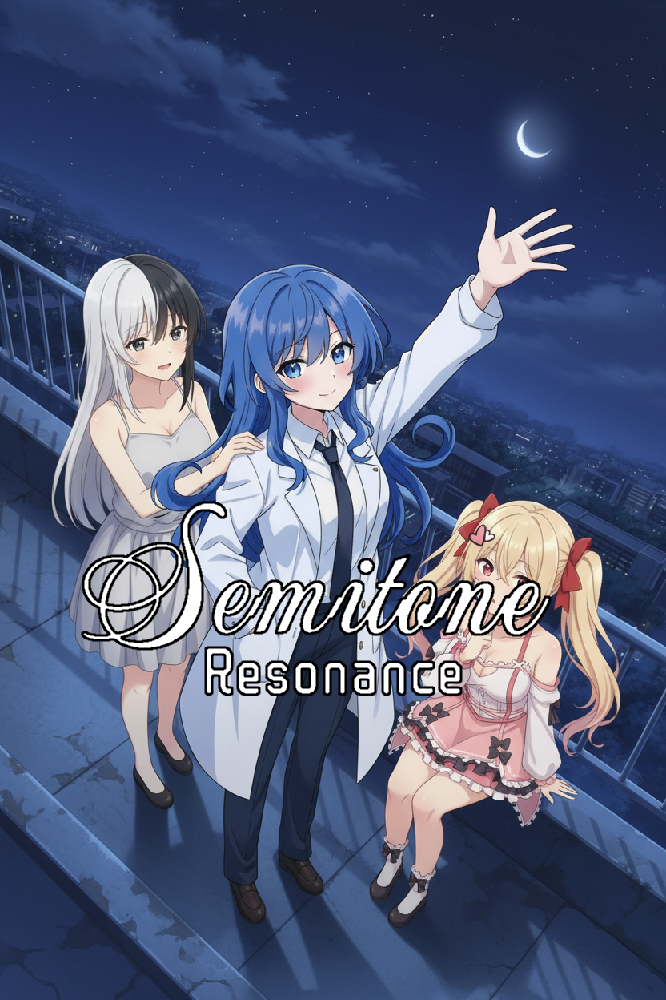
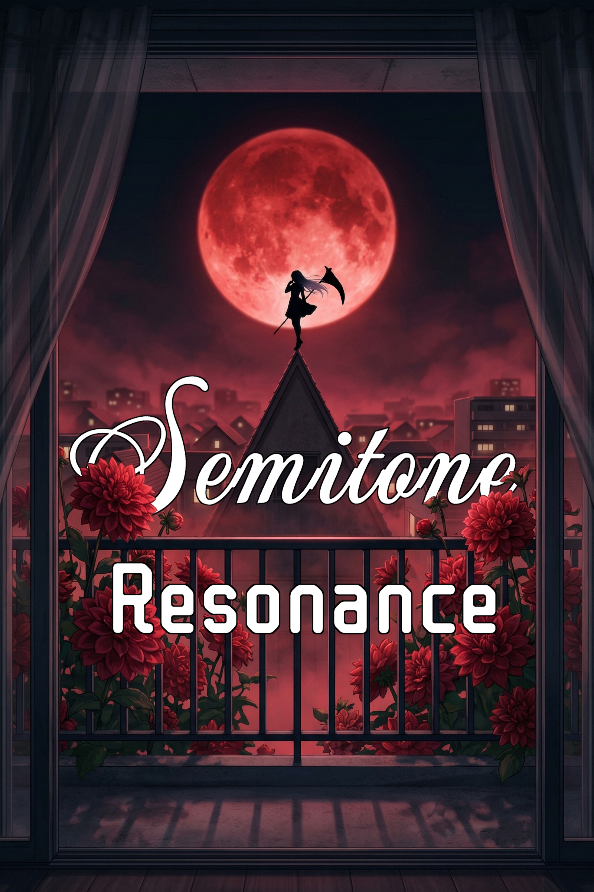

# The Brightest Neon - Semitone Resonance

[](https://github.com/DomDotDot/DoctorNeonPrototype/blob/main/README.md)
[](https://github.com/DomDotDot/DoctorNeonPrototype/blob/main/README.ru.md)




<!-- BADGES -->
<!-- STATS_BADGES:START -->


<!-- STATS_BADGES:END -->


[](LICENSE)
> A Sci-Fi Mystery Kinetic Novel.

## Project Structure

This repository contains the **source code** of the project (Developer View).
Folder layout:

```text
.
├── game/                   #   MAIN GAME FOLDER
│   ├── audio/              # Music and SFX
│   ├── devtools/           # Tools for game development
│   ├── fonts/              # Game fonts
│   ├── game-scripts/       # Game scripts (rpy)
│   ├── gui/                # Ren'Py GUI elements
│   ├── images/             # Sprites, BGs, and CGs (included in the build)
│   ├── libs/               # 3rd Party libraries
│   ├── modules/            # Game modules
│   ├── tl/                 # Translation folder
│   ├── launch.rpy          # Pre-menu workflow
│   ├── script.rpy          # Main script
│   ├── options.rpy         # Build config and settings
│
├── source_assets/          #   PROMO & SOURCE FILES
│   ├── images/             # Source images for game assets
│   ├── legacy/             # Legacy assets (no longer used)
│   ├── pdn-sketches/       # Paint.NET Source files
│   ├── promo/              # Steam/Itch.io assets
│   └── ...                 # (These files are NOT included in the final build)
│
├── .gitignore              # Git ignore list (cache, saves)
└── README.md               # Project documentation
```

---

## How to Run (For Developers)

1.  Install the **[Ren'Py SDK](https://www.renpy.org/latest/)** (Version 8.x+ recommended).
2.  Clone this repository or download the ZIP.
3.  Open the Ren'Py Launcher.
4.  Go to **"Preferences"** -> **"Projects Directory"** and select the folder where this repo is located.
5.  Click **"Refresh"**. The project should appear in the list.
6.  Click **"Launch Project"** to start the game.

---

## Development Process (Git Flow)

We use a simple branching structure:

*   🔴 **`main`** — Stable version. Only tested code goes here. This branch must always run without errors.
*   🟡 **`dev`** — Main development branch. All active work and new ideas happen here.
*   🔵 **`feature/name`** — Temporary branches for major mechanics (e.g., `feature/inventory` or `feature/minigame`). Once finished, they are merged into `dev` and deleted.

### How to contribute:
1.  Switch to the `dev` branch.
2.  Make your changes to the code/script.
3.  Verify that it runs correctly in Ren'Py.
4.  Commit your changes (`git commit`).
5.  When the update is ready for release, merge `dev` into `main`.

---

## Contributing & Modding

This is an **Open Source** project. I encourage mods, fan translations, and community code improvements.
You **do not need** to unpack `.rpa` archives or decompile the game. The entire source code is available right here.

### How to submit changes (Pull Requests)

Follow the standard GitHub flow:
1.  **Fork** this repository.
2.  Make changes in your fork.
3.  Create a **Pull Request (PR)** to the `dev` branch (or `main` for critical hotfixes).
4.  Once reviewed, I will merge your changes into the game.

---

### For Coders & Modders

If you want to add a feature or fix a bug:
*   Try not to modify existing files (`script.rpy`) unless it's a bug fix.
*   It's better to create a new file (e.g., `game/modules/module/my_feature.rpy`) — Ren'Py will detect it automatically. This reduces merge conflicts.
*   Use `init python` blocks or separate `labels` so your logic doesn't break the main plot flow.

### Developer Tools & Script Linter

*   **Story & Dialogue Stats Linter**: Run `tools/update_stats.bat` (or `python tools/script_stats_linter.py`) to automatically analyze dialogue, word counts, and refresh the badges and statistics in the README.

---

## Building

To create a distribution for players (Windows/Linux/Mac):
1. Open the Ren'Py Launcher.
2. Select the project.
3. Click **"Build Distributions"**.
4. Files from `source_assets` and Git system files are **automatically excluded** from the build (configured in `options.rpy`).


---

<!-- SCRIPT_STATS:START -->
## Story & Script Statistics

### General Metrics

| Metric | Value | Ratio |
| :--- | :---: | :--- |
| **Total Words** | **125 376** | `100%` |
| **Total Script Lines** | **5 994** | `100%` |
| Narration / Description | 83 825 words / 3 140 lines | `66.9%` ███████░░░ |
| Spoken Dialogue (Characters) | 41 551 words / 2 854 lines | `33.1%` ███░░░░░░░ |
| Unique Speakers | 102 | — |
| Script Files (.rpy) | 158 | — |

### Chapter Breakdown

| Chapter | Files | Lines | Words | Dialogue Share |
| :--- | :---: | :---: | :---: | :--- |
| **Chapter 1: The Blue Sheep** | 12 | 404 | 8 316 | `33.9%` ███░░░░░ |
| **Chapter 2: In Search of A Friend** | 8 | 164 | 5 870 | `13.9%` █░░░░░░░ |
| **Chapter 3: Escapism** | 18 | 361 | 7 357 | `29.4%` ██░░░░░░ |
| **Chapter 4.0: Ark Aground** | 6 | 329 | 6 819 | `49.0%` ████░░░░ |
| **Chapter 4.5: From Exile to Constellation** | 22 | 1 142 | 28 206 | `36.9%` ███░░░░░ |
| **Chapter 5: An Offer You Can’t Refuse** | 37 | 947 | 15 110 | `38.7%` ███░░░░░ |
| **Chapter 6: First row. Fifth seat.** | 7 | 355 | 7 214 | `30.3%` ██░░░░░░ |
| **Chapter 7: Fog of War** | 6 | 305 | 6 309 | `32.0%` ███░░░░░ |
| **Chapter 8: School Days...?** | 22 | 1 484 | 27 689 | `31.6%` ███░░░░░ |
| **Chapter 9: Resonating Dissonance** | 7 | 182 | 4 155 | `26.1%` ██░░░░░░ |
| **Flashbacks & Memory Fragments** | 13 | 321 | 8 331 | `25.5%` ██░░░░░░ |
| **TOTAL** | **158** | **5 994** | **125 376** | `33.1%` |

### Character Dialogue Distribution

| Character | Lines | Words | Word Share (of dialogue) |
| :--- | :---: | :---: | :--- |
| **Neon** | 1 214 | 14 518 | `34.9%` ███░░░░░ |
| **Seraphina** | 166 | 3 258 | `7.8%` █░░░░░░░ |
| **Argon** | 185 | 3 252 | `7.8%` █░░░░░░░ |
| **Oganesson (Guardian)** | 140 | 2 501 | `6.0%` ░░░░░░░░ |
| **Lily** | 141 | 2 117 | `5.1%` ░░░░░░░░ |
| **Celeste** | 111 | 1 650 | `4.0%` ░░░░░░░░ |
| **Alex** | 102 | 1 648 | `4.0%` ░░░░░░░░ |
| **Meryl Kendrick** | 57 | 1 301 | `3.1%` ░░░░░░░░ |
| **Sibyl** | 36 | 880 | `2.1%` ░░░░░░░░ |
| **Marcus** | 48 | 840 | `2.0%` ░░░░░░░░ |
| **Nari** | 56 | 705 | `1.7%` ░░░░░░░░ |
| **Sophie** | 41 | 527 | `1.3%` ░░░░░░░░ |
| **Akane (Mother)** | 32 | 525 | `1.3%` ░░░░░░░░ |
| **Xenon** | 21 | 506 | `1.2%` ░░░░░░░░ |
| **Teacher Akari** | 18 | 313 | `0.8%` ░░░░░░░░ |
| **Anna** | 14 | 136 | `0.3%` ░░░░░░░░ |
| **Helium** | 1 | 1 | `0.0%` ░░░░░░░░ |

<details>
<summary><b>Additional and episodic characters (85)</b></summary>

| Character | Lines | Words | Word Share |
| :--- | :---: | :---: | :--- |
| **???** | 42 | 502 | `1.2%` ░░░░░░░░ |
| **Priest** | 22 | 492 | `1.2%` ░░░░░░░░ |
| **Young Oganesson** | 26 | 485 | `1.2%` ░░░░░░░░ |
| **Guts** | 11 | 325 | `0.8%` ░░░░░░░░ |
| **Hans** | 14 | 301 | `0.7%` ░░░░░░░░ |
| **Young Alex** | 18 | 246 | `0.6%` ░░░░░░░░ |
| **News Anchor** | 6 | 235 | `0.6%` ░░░░░░░░ |
| **Entity / Illusion** | 10 | 226 | `0.5%` ░░░░░░░░ |
| **Garden Staff** | 18 | 213 | `0.5%` ░░░░░░░░ |
| **Student 2 (Carol)** | 18 | 206 | `0.5%` ░░░░░░░░ |
| **Student 1 (Amy)** | 7 | 199 | `0.5%` ░░░░░░░░ |
| **Carol** | 15 | 186 | `0.4%` ░░░░░░░░ |
| **Oda** | 9 | 165 | `0.4%` ░░░░░░░░ |
| **Boss** | 8 | 162 | `0.4%` ░░░░░░░░ |
| **Mr. Baumann (CEO)** | 10 | 158 | `0.4%` ░░░░░░░░ |
| **Amy** | 11 | 156 | `0.4%` ░░░░░░░░ |
| **Unknown Female** | 6 | 142 | `0.3%` ░░░░░░░░ |
| **Alex's Mom** | 9 | 129 | `0.3%` ░░░░░░░░ |
| **P.E. Teacher** | 14 | 123 | `0.3%` ░░░░░░░░ |
| **Anchorman** | 5 | 121 | `0.3%` ░░░░░░░░ |
| **Bartender** | 6 | 108 | `0.3%` ░░░░░░░░ |
| **Unknown** | 6 | 102 | `0.2%` ░░░░░░░░ |
| **Bandit 1** | 5 | 97 | `0.2%` ░░░░░░░░ |
| **ABSU / FCS** | 6 | 92 | `0.2%` ░░░░░░░░ |
| **Bouncer** | 14 | 91 | `0.2%` ░░░░░░░░ |
| **Dr. Grubenmann (CRO)** | 3 | 82 | `0.2%` ░░░░░░░░ |
| **Old Man** | 9 | 82 | `0.2%` ░░░░░░░░ |
| **Headteacher** | 3 | 74 | `0.2%` ░░░░░░░░ |
| **Automaton** | 9 | 72 | `0.2%` ░░░░░░░░ |
| **Young Hoshiko** | 7 | 69 | `0.2%` ░░░░░░░░ |
| **Kai Ito** | 4 | 66 | `0.2%` ░░░░░░░░ |
| **Bartender Staff** | 4 | 63 | `0.2%` ░░░░░░░░ |
| **Bandit 2** | 3 | 60 | `0.1%` ░░░░░░░░ |
| **Waitress** | 5 | 60 | `0.1%` ░░░░░░░░ |
| **Mika Kitamura** | 4 | 58 | `0.1%` ░░░░░░░░ |
| **Concierge** | 5 | 58 | `0.1%` ░░░░░░░░ |
| **Worker 1** | 2 | 47 | `0.1%` ░░░░░░░░ |
| **Academy Director** | 2 | 43 | `0.1%` ░░░░░░░░ |
| **Rico** | 6 | 41 | `0.1%` ░░░░░░░░ |
| **Ishikawa-sensei** | 2 | 36 | `0.1%` ░░░░░░░░ |
| **Woman** | 5 | 36 | `0.1%` ░░░░░░░░ |
| **Security Captain** | 3 | 31 | `0.1%` ░░░░░░░░ |
| **Student A** | 2 | 30 | `0.1%` ░░░░░░░░ |
| **Fan 1** | 4 | 30 | `0.1%` ░░░░░░░░ |
| **Girl (Neon)** | 5 | 29 | `0.1%` ░░░░░░░░ |
| **Fan 2** | 3 | 29 | `0.1%` ░░░░░░░░ |
| **Fan 3** | 3 | 29 | `0.1%` ░░░░░░░░ |
| **Control Officer** | 4 | 24 | `0.1%` ░░░░░░░░ |
| **Student C** | 1 | 24 | `0.1%` ░░░░░░░░ |
| **Concierge (Female)** | 3 | 24 | `0.1%` ░░░░░░░░ |
| **Consultant** | 2 | 24 | `0.1%` ░░░░░░░░ |
| **Guard** | 4 | 23 | `0.1%` ░░░░░░░░ |
| **Worker 2** | 2 | 23 | `0.1%` ░░░░░░░░ |
| **Navigator** | 2 | 23 | `0.1%` ░░░░░░░░ |
| **Driver** | 1 | 22 | `0.1%` ░░░░░░░░ |
| **CEO's Voice** | 1 | 21 | `0.1%` ░░░░░░░░ |
| **Medrobot** | 3 | 20 | `0.0%` ░░░░░░░░ |
| **Security Officer** | 2 | 17 | `0.0%` ░░░░░░░░ |
| **Student B** | 1 | 17 | `0.0%` ░░░░░░░░ |
| **Mercenary Commander** | 3 | 16 | `0.0%` ░░░░░░░░ |
| **Fan 4** | 2 | 16 | `0.0%` ░░░░░░░░ |
| **Shareholder 2's Voice** | 1 | 16 | `0.0%` ░░░░░░░░ |
| **Vendor** | 1 | 15 | `0.0%` ░░░░░░░░ |
| **Commander** | 2 | 15 | `0.0%` ░░░░░░░░ |
| **Student 1** | 1 | 13 | `0.0%` ░░░░░░░░ |
| **Student 1 (Girl)** | 1 | 13 | `0.0%` ░░░░░░░░ |
| **Passenger** | 1 | 11 | `0.0%` ░░░░░░░░ |
| **Voice** | 3 | 11 | `0.0%` ░░░░░░░░ |
| **Father** | 1 | 9 | `0.0%` ░░░░░░░░ |
| **Shareholder 1's Voice** | 1 | 9 | `0.0%` ░░░░░░░░ |
| **Fan 5** | 1 | 8 | `0.0%` ░░░░░░░░ |
| **Celeste (Phantom)** | 1 | 8 | `0.0%` ░░░░░░░░ |
| **Shareholder 1** | 1 | 8 | `0.0%` ░░░░░░░░ |
| **Bully 2** | 1 | 7 | `0.0%` ░░░░░░░░ |
| **Boy** | 2 | 7 | `0.0%` ░░░░░░░░ |
| **Bully 1** | 1 | 6 | `0.0%` ░░░░░░░░ |
| **Guard's Voice** | 1 | 6 | `0.0%` ░░░░░░░░ |
| **Security Commander** | 1 | 5 | `0.0%` ░░░░░░░░ |
| **Passerby** | 1 | 5 | `0.0%` ░░░░░░░░ |
| **Bodyguard** | 2 | 5 | `0.0%` ░░░░░░░░ |
| **Clara** | 3 | 4 | `0.0%` ░░░░░░░░ |
| **Students** | 1 | 4 | `0.0%` ░░░░░░░░ |
| **Desk Neighbor** | 1 | 3 | `0.0%` ░░░░░░░░ |
| **Courier** | 1 | 3 | `0.0%` ░░░░░░░░ |
| **Absolute Silence** | 1 | 1 | `0.0%` ░░░░░░░░ |

</details>

<!-- SCRIPT_STATS:END -->

## License & Rights

This project uses a hybrid license to encourage learning and modding while protecting proprietary content.

*   💻 **Source Code** (Logic, Mechanics, GUI) is licensed under **MIT**.
    *   *You are free to use the code in your own projects, even commercial ones.*
*   🎨 **Story & Assets** (Script, Graphics, Music, Characters) are licensed under **CC BY-NC-SA 4.0**.
    *   *You are free to create mods, translations, and fan art.*
    *   *⛔ **Commercial use is prohibited.** You cannot sell the game or its assets.*

See [LICENSE](LICENSE) for the full text.
