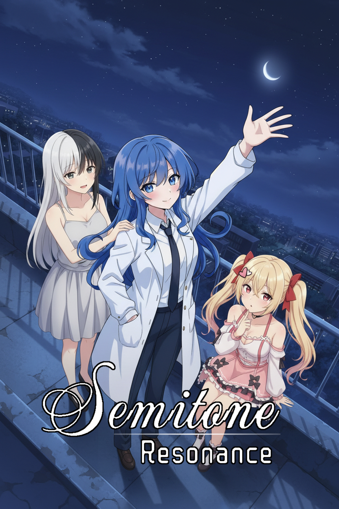

# The Brightest Neon - Semitone Resonance



<!-- БЕЙДЖИ -->


[](LICENSE)
> Кинетическая новелла в жанре SCI-FI мистики.

## 📂 Структура проекта

Этот репозиторий содержит **исходный код** проекта (Developer View).
Структура папок организована следующим образом:

```text
.
├── game/                   # 🎮 ОСНОВНАЯ ПАПКА ИГРЫ
│   ├── audio/              # Музыка и звуки
│   ├── fonts/              # Шрифты игры
│   ├── gui/                # Элементы интерфейса Ren'Py
│   ├── images/             # Спрайты, фоны и CG (то, что идет в билд)
│   ├── libs/               # 3-rd Party библиотеки
│   ├── modules/            # Модули игры
│   ├── tl/                 # Папка с переводами
│   ├── launch.rpy          # Workflow игры перед главным меню
│   ├── script.rpy          # Главный сценарий
│   ├── options.rpy         # Настройки сборки и названия
│
├── image-assets/           # 🎨 ПРОМО И ИСХОДНИКИ
│   ├── pdn-sketches/       # PDN Исходники
│   ├── promo/              # Арты для Steam/Itch.io
│   └── ...                 # (Эти файлы НЕ попадают в финальный билд игры)
│
├── .gitignore              # Список файлов, игнорируемых Git (кэш, сохранения)
└── README.md               # Документация проекта
```

---

## Как запустить проект (для разработки)

1. Установите **[Ren'Py SDK](https://www.renpy.org/latest/)** (версия 8.x+ рекомендуется).
2. Склонируйте этот репозиторий или скачайте ZIP.
3. Откройте Ren'Py Launcher.
4. Выберите **"Preferences" (Настройки)** -> **"Projects Directory" (Папка проектов)** и укажите путь, где лежит папка этого репозитория.
5. Нажмите **"Refresh"**. Проект появится в списке.
6. Нажмите **"Launch Project"**, чтобы запустить игру.

---

## Процесс разработки (Git Flow)

Мы используем простую структуру веток для одиночной разработки:

*   **`main`** — Стабильная версия. Сюда попадает только проверенный код. Эта версия всегда должна запускаться без ошибок.
*   **`dev`** — Основная ветка разработки. Все новые идеи и текущая работа ведутся здесь.
*   **`feature/name`** — Временные ветки для создания крупных механик (например, `feature/inventory` или `feature/minigame`). После завершения они вливаются в `dev` и удаляются.

### Как внести изменения:
1. Переключитесь на ветку `dev`.
2. Внесите изменения в код/сценарий.
3. Проверьте работоспособность в Ren'Py.
4. Закоммитьте изменения (`git commit`).
5. Когда обновление готово к релизу — слейте `dev` в `main`.

---

## Контрибуция и Моддинг

Этот проект **Open Source**. Я поддерживаю создание модов, фанатских переводов и улучшение кода сообществом.
Вам **не нужно** распаковывать `.rpa` архивы или декомпилировать игру. Весь исходный код доступен здесь.

### Как предложить изменения (Pull Requests)

Используете стандартный процесс GitHub:
1.  Сделайте **Fork** этого репозитория (кнопка сверху справа).
2.  Внесите изменения в своем форке.
3.  Создайте **Pull Request (PR)** в ветку `dev` (или `main`, если это критический хотфикс).
4.  После проверки кода я волью ваши изменения в игру.

---

### Для программистов и моддеров

Если вы хотите добавить фичу или исправить баг:
*   Старайтесь не менять существующие файлы (`script.rpy`), если это не багфикс.
*   Лучше создайте новый файл (например, `game/scripts/my_feature.rpy`) — Ren'Py подхватит его автоматически. Это уменьшит конфликты при слиянии.
*   Используйте `init python` блоки или отдельные `labels`, чтобы ваша логика не ломала основной сюжет.
---

## Сборка (Build)

Чтобы создать дистрибутив для игроков (Windows/Linux/Mac):
1. Откройте Ren'Py Launcher.
2. Выберите проект.
3. Нажмите **"Build Distributions"**.
4. Все файлы из папки `image-assets` и системные файлы Git будут **автоматически исключены** из сборки (настраивается в `options.rpy`).

## Лицензия и Права

Этот проект использует гибридную лицензию, чтобы поощрять обучение и моддинг, защищая при этом авторский контент.

*   **Программный код** (логика, механики, GUI) распространяется под лицензией **MIT**. 
    *   *Вы можете свободно использовать код в своих проектах, даже коммерческих.*
*   **Сюжет и Ассеты** (сценарий, графика, музыка, персонажи) распространяются под лицензией **CC BY-NC-SA 4.0**.
    *   *Вы можете создавать моды, переводы и фанатское творчество.*
    *   **Запрещено** использовать ассеты и сюжет в коммерческих целях (продавать игру или её части).*

Полный текст лицензии доступен в файле [LICENSE](LICENSE).
